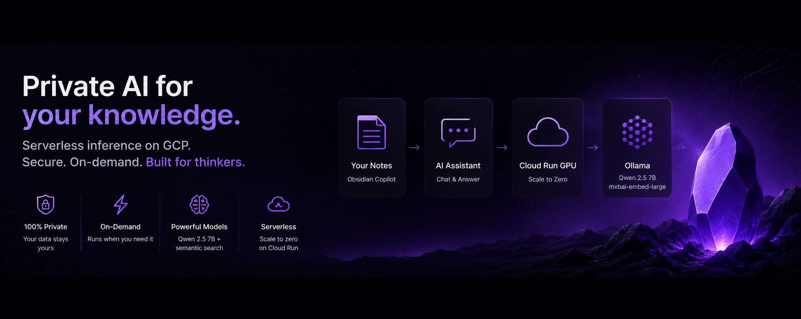

# Obsidian Cloud Run Ollama



Serverless Ollama endpoint on GCP Cloud Run (NVIDIA L4 GPU) for Obsidian Copilot chat and vault QA. Works from desktop and mobile Obsidian.

## Architecture

```text
Obsidian (desktop + mobile)
  → Obsidian Copilot Plugin
  → HTTPS + Authorization: Bearer <OLLAMA_API_KEY>
  → FastAPI proxy (:8080)
  → Ollama (:11434)
  → in-memory model store (/root/.ollama) — fast GPU loads
  → qwen2.5:7b / mxbai-embed-large
```

## Defaults

| Setting | Value |
|---------|-------|
| GCP project | `your-project-id` |
| Region | `us-central1` |
| Service | `obsidian-ollama` |
| GPU | 1× NVIDIA L4 |
| CPU / memory | 4 vCPU / 16 GiB |
| Min / max instances | 0 / 1 |
| Concurrency | 1 |
| Timeout | 3600s |
| Chat model | `qwen2.5:7b` |
| Embedding model | `mxbai-embed-large` |
| Model storage | In-memory volume (default); optional GCS with `PERSIST_MODELS=1` |

## Deploy

```bash
cd obsidian-cloudrun-ollama
chmod +x deploy.sh start.sh
./deploy.sh
```

Optional overrides:

```bash
PROJECT_ID=your-project-id REGION=us-central1 OLLAMA_API_KEY=your-secret ./deploy.sh
```

After deploy, save the printed `OLLAMA_API_KEY`. Use `.env.example` as a template.

Note: Cloud Run reserves `/healthz`, so this service exposes readiness at `/status` instead.

## Security

The service is publicly reachable over HTTPS so Obsidian mobile can connect. Access is gated by the standard Ollama API key header:

```text
Authorization: Bearer <OLLAMA_API_KEY>
```

Obsidian Copilot sends this automatically when you set the API key on each custom Ollama model. This matches how Ollama clients authenticate to `ollama.com`.

## Endpoints

| Path | Auth | Purpose |
|------|------|---------|
| `GET /status` | No | Readiness (Ollama + models) |
| `POST /warmup` | Yes | Pre-load chat model after cold start |
| `GET /api/tags` | Yes | List models |
| `POST /api/generate` | Yes | Text generation |
| `POST /api/embeddings` | Yes | Embeddings for vault QA |
| `POST /api/chat` | Yes | Chat completions |

## Test

```bash
SERVICE_URL="https://your-service-xxx.run.app"
OLLAMA_API_KEY="your-key-from-deploy"

curl -H "Authorization: Bearer ${OLLAMA_API_KEY}" \
  "${SERVICE_URL}/api/tags"

curl -H "Authorization: Bearer ${OLLAMA_API_KEY}" \
  -H "Content-Type: application/json" \
  -d '{"model":"qwen2.5:7b","prompt":"Summarize Obsidian in one paragraph.","stream":false}' \
  "${SERVICE_URL}/api/generate"

curl -H "Authorization: Bearer ${OLLAMA_API_KEY}" \
  -H "Content-Type: application/json" \
  -d '{"model":"mxbai-embed-large","prompt":"This is a test note about startup pricing."}' \
  "${SERVICE_URL}/api/embeddings"
```

Warm up after idle:

```bash
curl -X POST \
  -H "Authorization: Bearer ${OLLAMA_API_KEY}" \
  "${SERVICE_URL}/warmup"
```

## Obsidian Copilot Configuration

In Obsidian → Settings → Community Plugins → Copilot → Model settings, add two custom models:

**Chat model**

- Provider: Ollama
- Model name: `qwen2.5:7b`
- Base URL: `https://your-service-xxx.run.app`
- API key: your `OLLAMA_API_KEY`

**Embedding model**

- Provider: Ollama
- Model name: `mxbai-embed-large` (exact name; do not use `:latest`)
- Base URL: `https://your-service-xxx.run.app`
- API key: your `OLLAMA_API_KEY`

If you see "model not found" after a cold start, wait 1–2 minutes for models to finish loading, or call `POST /warmup` and retry indexing.

Use the same base URL and API key on desktop and mobile.

Enable vault features:

- Vault QA
- Semantic search
- Index vault

## Cold Start Behavior

By default, models live on a **fast in-memory volume** (not GCS). The proxy starts immediately; the **first chat or embed request** after a cold start downloads and loads the model (slow once). Later requests on the same warm instance are fast.

| Phase | Typical time |
|-------|----------------|
| Container + proxy ready | ~30s |
| First request (pull + GPU load) | ~2–8 min |
| Later requests (warm instance) | seconds |

Optional persistence (slower cold start, skips re-download from internet):

```bash
PERSIST_MODELS=1 PREFETCH_MODELS=background ./deploy.sh
```

This hydrates from GCS into memory at boot, then runs inference from memory. Do not point Ollama directly at GCS FUSE — reads are too slow for generation.

Mitigations:

- Call `POST /warmup` after idle to pay the first-load cost before chatting
- Keep `max-instances=1` to avoid duplicate cold starts

## Cost Controls

```text
min-instances: 0   → scales to zero when idle
max-instances: 1   → single-user cap, no surprise scaling
concurrency: 1     → one request at a time per instance
```

Expected billing: near zero when idle; GPU + CPU + memory per second when active.

## Local Docker Test

Requires NVIDIA GPU and Docker GPU support:

```bash
docker build -t obsidian-ollama .
docker run --gpus all -p 8080:8080 -e OLLAMA_API_KEY=test obsidian-ollama
curl http://localhost:8080/status
curl -H "Authorization: Bearer test" http://localhost:8080/api/tags
```

## Production Improvements

- Add structured request metrics to Cloud Logging
- Tune memory to 32 GiB if models OOM
- Set `PERSIST_MODELS=1` only if you want models cached in GCS between cold starts (hydrated to memory at boot)
